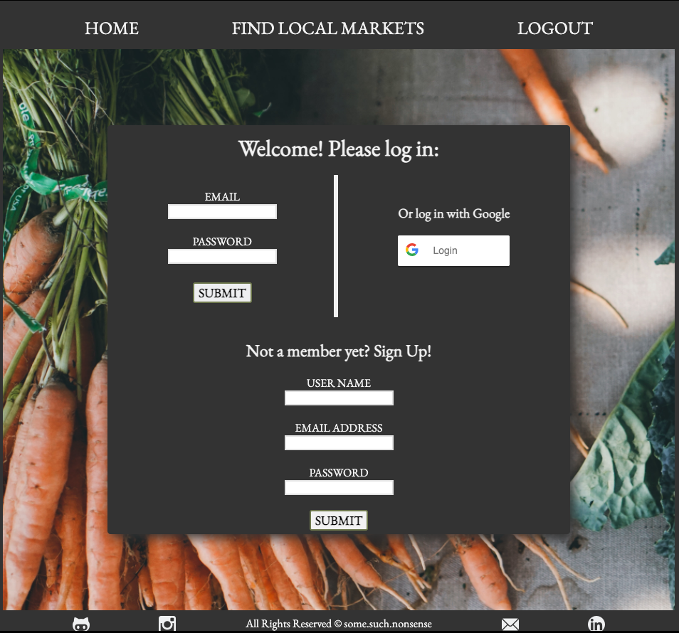

[![Contributors][contributors-shield]][contributors-url]
[![Forks][forks-shield]][forks-url]
[![Stargazers][stars-shield]][stars-url]
[![Issues][issues-shield]][issues-url]
[![MIT License][license-shield]][license-url]
[![LinkedIn][linkedin-shield]][linkedin-url]


<!-- PROJECT LOGO -->
<br />
<p align="center">


  <h3 align="center">MY FARMERS MARKET API </h3>

  <p align="center">
    A RESTful API built with Typescript on an Express framework with PSQL and TypeORM database management tools. Paired with a Client Side TS-React application located <a href="https://github.com/pollipayne/farmers-market-font-end"> HERE </a>
    <br />
    <a href="https://github.com/pollipayne/farmers-market-back-end"><strong>Explore the docs »</strong></a>
    <br />
    <br />
    <a href="https://github.com/pollipayne/farmers-market-back-end">View Demo</a>
    ·
    <a href="https://github.com/pollipayne/farmers-market-back-end/issues">Report Bug</a>
    ·
    <a href="https://github.com/pollipayne/farmers-market-back-end/issues">Request Feature</a>
  </p>
</p>


<!-- TABLE OF CONTENTS -->
<details open="open">
  <summary><h2 style="display: inline-block">Table of Contents</h2></summary>
  <ol>
    <li>
      <a href="#about-the-project">About The Project</a>
      <ul>
        <li><a href="#built-with">Built With</a></li>
      </ul>
    </li>
    <li>
      <a href="#getting-started">Getting Started</a>
      <ul>
        <li><a href="#prerequisites">Prerequisites</a></li>
        <li><a href="#installation">Installation</a></li>
      </ul>
    </li>
    <li><a href="#usage">Usage</a></li>
    <li><a href="#roadmap">Roadmap</a></li>
    <li><a href="#contributing">Contributing</a></li>
    <li><a href="#license">License</a></li>
    <li><a href="#contact">Contact</a></li>
    <li><a href="#acknowledgements">Acknowledgements</a></li>
  </ol>
</details>


<!-- ABOUT THE PROJECT -->
## About The Project

<p align="center">
  <a href="https://github.com/pollipayne/farmers-market-front-end">
    
  </a>
  </p>

My Farmers Market API is the backend server feature for the My Farmers Market client side web applicaiton.  You can view a deployed demo of the application <a href="https://github.com/pollipayne/farmers-market-font-end"> HERE </a>.  


### Built With

* [TypeScript](https://www.npmjs.com/package/typescript)
* [NodeJs](https://nodejs.org/en/download/)
* [Express](https://www.npmjs.com/package/express)
* [npm](https://www.npmjs.com/package/npm)
* [PostgreSQL](https://www.postgresql.org/download/)
* [TypeORM](https://www.npmjs.com/package/typeorm)


<!-- GETTING STARTED -->
## Getting Started

To get a local copy up and running follow these simple steps.

### Prerequisites

* Download NodeJS for macOS or Windows <a href="https://nodejs.org/en/download/"> HERE </a>.  
* npm - in your terminal or chosen CLI run: 
  ```sh
  npm install npm@latest -g
  ```

### Installation

1. Clone the repo
   ```sh
   git clone https://github.com/pollipayne/farmers-market-back-end.git
   ```
2. Install NPM packages and dependencies
   ```sh
   npm install
   ```


<!-- USAGE EXAMPLES -->
## Usage

The structure for the 'Markets' route shown below. The models for Users, Vendors, and Products follow a similar pattern. 

* **RootURL**:  <a href="https://cryptic-fjord-56843.herokuapp.com/">https://cryptic-fjord-56843.herokuapp.com/</a>

**Markets Route**


* **URL**

  '/markets'
  '/markets/:id'

* **Method:**

  `GET` | `POST` | `DELETE` 
  
*  **URL Params**

   `GET` : To retrieve all 

    `GET` : `id=[integer]` To retrieve single market 

    `POST` : To post new market - request body should be shaped as follows: <br>
  `{ "newMarket": { 
     "marketName": string,
    "marketLocation": string,
    "marketSeason": string
}` <br>
    `DELETE` : `id=[integer]`  To delete single market
 


* **Success Response:**

  * Sample payload  `GET` single market by ID: 
  
  * **Code:** 200 <br />
    **Content:** `{"id":1,"marketName":"West Seattle Farmers Market","marketLocation":"California Junction","marketSeason":"Year-Round 10AM-2PM","users":[],"vendors":[]}`
 


<!-- ROADMAP -->
## Roadmap

Forthcoming additional features: 

* PUT/PATCH paths on all models 
* GET requests that query a specific model ID and show references to it's related models. (i.e user requests to see all local vendors they have ever bought eggs from. )


<!-- CONTRIBUTING -->
## Contributing

Contributions are what make the open source community such an amazing place to be learn, inspire, and create. Any contributions you make are **greatly appreciated**.

1. Fork the Project
2. Create your Feature Branch (`git checkout -b feature/AmazingFeature`)
3. Commit your Changes (`git commit -m 'Add some AmazingFeature'`)
4. Push to the Branch (`git push origin feature/AmazingFeature`)
5. Open a Pull Request


<!-- LICENSE -->
## License

Distributed under the MIT License. See `LICENSE` for more information.


<!-- CONTACT -->
## Contact

Brittney Payne - [@LinkedIn](https://www.linkedin.com/in/brittney-payne-1824701b7/) - brpayne598@gmail.com

Project Link: [https://github.com/pollipayne/farmers-market-back-end](https://github.com/pollipayne/farmers-market-back-end)


<!-- ACKNOWLEDGEMENTS -->
## Acknowledgements

* [Ada Developers Academy](https://adadevelopersacademy.org/organization/)


[contributors-shield]: https://img.shields.io/github/contributors/pollipayne/farmers-market-front-end.svg?style=for-the-badge
[contributors-url]: https://github.com/pollipayne/farmers-market-front-end/graphs/contributors
[forks-shield]: https://img.shields.io/github/forks/pollipayne/farmers-market-front-end.svg?style=for-the-badge
[forks-url]: https://github.com/pollipayne/farmers-market-front-end/network/members
[stars-shield]: https://img.shields.io/github/stars/pollipayne/farmers-market-front-end.svg?style=for-the-badge
[stars-url]: https://github.com/pollipayne/farmers-market-front-end/stargazers
[issues-shield]: https://img.shields.io/github/issues/pollipayne/farmers-market-front-end.svg?style=for-the-badge
[issues-url]: https://github.com/pollipayne/farmers-market-front-end/issues
[license-shield]: https://img.shields.io/github/license/pollipayne/farmers-market-front-end.svg?style=for-the-badge
[license-url]: https://github.com/pollipayne/farmers-market-front-end/blob/master/LICENSE.txt
[linkedin-shield]: https://img.shields.io/badge/-LinkedIn-black.svg?style=for-the-badge&logo=linkedin&colorB=555
[linkedin-url]: https://www.linkedin.com/in/brittney-payne-1824701b7/


